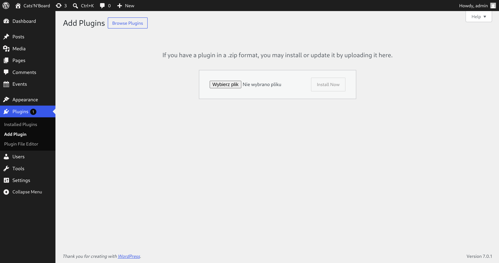
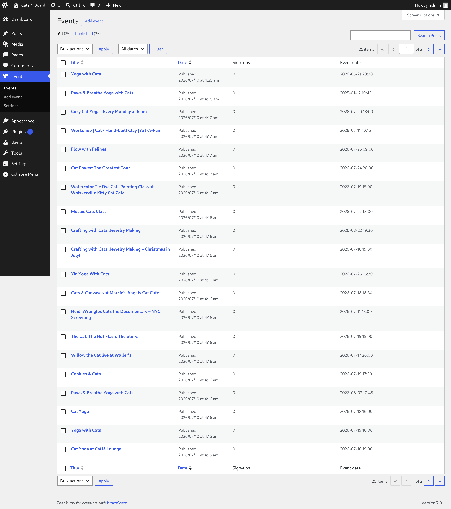
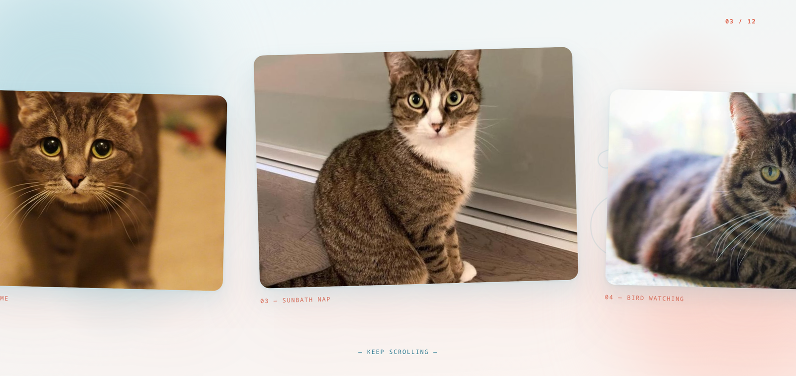
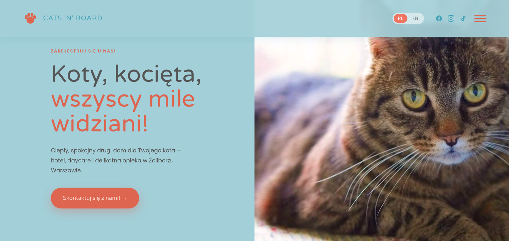

# Instrukcja obsługi — strona Cats'N'Board

Cześć! 👋 Ta instrukcja tłumaczy **prostym językiem** jak obsługiwać Twoją stronę.
Nie musisz się znać na komputerach — każdy krok jest opisany po kolei.

Produktem są **2 wtyczki** — wgrywasz je na **swoją istniejącą stronę** (ze swoim wyglądem):

| Co | Do czego służy |
|---|---|
| **wtyczka Galeria i Wydarzenia** (`pnb-blocks...zip`) | Galeria zdjęć + kalendarz wydarzeń z zapisami gości |
| **wtyczka Polska Wersja** (`pnb-auto-pl...zip`) | Cała strona po polsku, z przełącznikiem PL / EN |

> ⚠️ **Dostałeś od nas osobno plik `catsnboard-motyw...zip`?** To **tylko makieta do testów**
> (odtworzony wygląd, na którym sprawdzaliśmy wtyczki). **NIE wgrywaj go na swoją prawdziwą
> stronę** — masz już swój wygląd. Do działania potrzebne są tylko 2 wtyczki z tej paczki.

> 💡 **Zanim zaczniesz — o co chodzi?** Twoja strona działa na **WordPressie**. Logujesz się do
> „panelu" (kuchni strony), a goście widzą gotową stronę. Panel otwierasz wpisując w przeglądarce
> adres: **`twojastrona.pl/wp-admin`**

### ⏱️ Ile to zajmie i czego potrzebujesz

Całość zajmie Ci **około 15–20 minut**. Przygotuj:

- ✅ **login i hasło** do panelu (`twojastrona.pl/wp-admin`)
- ✅ **2 pliki ZIP** z wtyczkami (są w tej paczce)
- ✅ **internet**
- ✅ *opcjonalnie:* klucz **Claude API** (KROK 5) — tylko jeśli chcesz, żeby NOWE treści tłumaczyły się same

**Co po którym kroku:** KROK 0 kopia (5 min) → 1 wtyczki (5 min) → 2 galeria (3 min) →
3 wydarzenia (3 min) → 4 automat (opcja, 2 min) → 5 tłumaczenie (10 min) → 6 baza (0 min, nic nie robisz).

---

## 💾 KROK 0 — Zrób kopię zapasową (5 minut, WAŻNE)

Zanim cokolwiek wgrasz — zrób **kopię zapasową strony**. To siatka bezpieczeństwa: gdyby
cokolwiek poszło nie tak, przywracasz kopię i jest jak było.

- **Najprościej:** poproś swój **hosting** (tam gdzie kupiłeś stronę) o zrobienie backupu — robią to w minutę.
- **Albo sam:** wgraj darmową wtyczkę **UpdraftPlus** → kliknij **Backup Now**.

> Zalecamy zrobienie kopii zapasowej przed każdą instalacją — to Twoja siatka bezpieczeństwa.

---

## ✅ KROK 1 — Wgraj 2 wtyczki (raz, 5 minut)

1. Zaloguj się: wpisz w przeglądarce **`twojastrona.pl/wp-admin`** → podaj login i hasło
2. W menu po lewej: **Wtyczki → Dodaj nową** *(Plugins → Add New)*
3. Na górze: **Wyślij wtyczkę na serwer** *(Upload Plugin)* → **Wybierz plik**

4. Wskaż `pnb-blocks...zip` → **Zainstaluj** → **Włącz**
5. **Powtórz to samo** z drugim plikiem: `pnb-auto-pl...zip`

Po włączeniu obu — na liście wtyczek zobaczysz je jako **aktywne** (podświetlone):

✅ Gotowe! Wejdź na swoją stronę (bez `/wp-admin`) — zobaczysz galerię zdjęć kotów,
kalendarz wydarzeń i przełącznik **PL / EN** w prawym górnym rogu. **To, co dodały wtyczki
(galeria, wydarzenia, przyciski), jest po polsku od razu.** Twoje własne, starsze treści
przetłumaczysz jednym kliknięciem w KROKU 5.
Wtyczki działają na Twoim wyglądzie — dokładają do niego galerię i wydarzenia, nic nie psując.

> ⚠️ **Masz na stronie wtyczkę WPML** (do wielu języków)? **Wyłącz ją** przed włączeniem naszej
> Polskiej Wersji — inaczej dwa mechanizmy tłumaczenia będą się gryzły. (Nasza wtyczka robi
> polski sama, WPML nie jest potrzebny.) Nie wiesz czy masz WPML? Zajrzyj w **Wtyczki** — jak
> nie ma tam „WPML", to nie masz i nic nie robisz.

> 💡 **Chcesz panel po polsku?** Wejdź w **Użytkownicy → Profil → Język → Polski**
> *(Users → Profile → Language → Polski)*. Wtedy przyciski będą po polsku.
> ⚠️ **NIE zmieniaj** „Język witryny" w Ustawienia → Ogólne — to musi zostać **English**
> (polską wersję dla gości robi nasza wtyczka).

---

## 🖼️ KROK 2 — Galeria: gdzie ją wstawić i jak zmienić zdjęcia (~3 min)

Galeria to **blok** — wstawiasz go na dowolną swoją stronę:

1. Otwórz stronę, na której chcesz galerię (**Strony → Edytuj** *(Pages → Edit)*)
2. Kliknij **+** (dodaj blok) → wyszukaj **„PNB Galeria"** → wstaw
3. Kliknij w galerię — pokażą się przyciski:
   - **Wybierz zdjęcia** — zdjęcia górnej taśmy (ta przewijana)
   - **Wybierz zdjęcia „Moments"** — zdjęcia dolnej sekcji (osobny zestaw!)
4. Zaznacz zdjęcia (możesz dodać własne z komputera) → **Aktualizuj galerię**
5. Kliknij niebieski **Zapisz / Aktualizuj** w prawym górnym rogu

Napisy i podpisy zmieniasz klikając prosto w tekst. Kalendarz wydarzeń wstawiasz tak samo —
blokiem **„PNB Wydarzenia"** na wybranej stronie.

---

## 📅 KROK 3 — Wydarzenia: jak dodać samemu (~3 min)

1. Menu po lewej: **Events → Dodaj nowe** *(Events → Add New)*
2. Wpisz **tytuł i opis** (po angielsku — polski zrobi się sam, patrz KROK 5)
3. Po prawej uzupełnij: **datę, godzinę, miejsce, ile miejsc** (0 = bez limitu)
4. **Ustaw zdjęcie wydarzenia** — przycisk w bocznym panelu (nie wklejaj zdjęcia do opisu!)
5. **Opublikuj** — wydarzenie samo pojawi się na stronie

**Kto się zapisał?** Otwórz wydarzenie do edycji — lista gości jest w ramce
**Zapisani goście** (z przyciskiem eksportu do Excela).

**Chcesz dostawać e-mail przy każdym zapisie?** Wejdź w **Events → Settings** i wpisz swój adres
w polu **„E-mail powiadomień"** *(Notification email)* → kliknij **„Zapisz ustawienia"**
*(Save settings)*. Nazwy widzisz po polsku albo po angielsku — zależnie od języka Twojego panelu.
Od teraz przy każdym zapisie gościa dostaniesz e-mail z jego danymi (imię, mail, telefon).

> Zostawisz to pole puste? Powiadomienia pójdą na adres administratora strony — też zadziała.

> ⚠️ **E-maile mogą wpadać do SPAMU** — tak działają serwery, nie wtyczka. Ale zapisy
> **zawsze** są w panelu, nic nie ginie. Chcesz pewnych maili? Poproś hosting o „SMTP"
> albo wgraj darmową wtyczkę **WP Mail SMTP**.

---

## 🤖 KROK 4 — Automat: strona sama pobiera wydarzenia (opcjonalne)

Wtyczka umie **sama pobierać wydarzenia** z internetu (z serwisu Eventbrite) i dodawać je na
Twoją stronę — bez ręcznego wpisywania. Jak nie chcesz, po prostu tego nie włączaj.

**Jak włączyć:**
1. Menu: **Events → Settings** *(Ustawienia)*
2. W polu **„Event source (Eventbrite URL)"** wklej adres listy wydarzeń z Eventbrite
3. **Zapisz**. Od teraz wtyczka **co jakiś czas sama sprawdza** i dodaje nowe wydarzenia
4. Chcesz sprawdzić od razu? Kliknij **„Sync now (test)"** — pobierze bez czekania

**Co automat robi sam (bez Ciebie):**
- ✅ **Dodaje** nowe wydarzenia + pobiera im zdjęcia
- ✅ **Tłumaczy** je na polski (jeśli masz wpięty klucz — patrz KROK 5)
- ✅ **Zdejmuje do kosza** wydarzenia które zniknęły ze źródła
- ✅ **Szanuje Twoje decyzje** — jak sam usuniesz wydarzenie do kosza, automat go NIE przywróci
- ✅ **Nie nadpisuje Twoich poprawek** — zmienisz zaimportowane wydarzenie → Twoja wersja zostaje

Efekt widzisz w menu **Events** — wydarzenia zbierają się same, ze zdjęciami:

> ⏱️ **Jak często sprawdza?** Automat budzi się **gdy ktoś wchodzi na stronę**. Jak strona ma
> ruch — działa sam. Jak jest cicha, poproś hosting o **„cron"** pukający w
> `twojastrona.pl/wp-cron.php` co 10 minut, albo użyj darmowej **cron-job.org** (wklejasz tam
> ten adres, bez żadnego kodu).

> ⚠️ **WAŻNE — prawo:** upewnij się że masz **prawo** pobierać dane z serwisu który podajesz.
> Wiele serwisów (w tym Eventbrite) zabrania tego w regulaminie. Jak jesteś **organizatorem**
> swoich wydarzeń — najbezpieczniej użyć oficjalnego API serwisu. Odpowiedzialność jest po
> stronie właściciela strony.

---

## 🇵🇱 KROK 5 — Polska wersja i klucz do tłumaczenia (~10 min)

**Dobra wiadomość:** teksty strony są **już po polsku** (słownik jest w paczce) — przełącznik
**PL / EN** działa od pierwszego dnia, bez niczego.

**Klucz API** potrzebujesz TYLKO po to, żeby **NOWE treści** (nowe wydarzenia, Twoje zmiany)
tłumaczyły się same. To „silnik" tłumaczenia — Claude AI. Płacisz tylko za to co tłumaczysz (grosze).

**Jak zdobyć klucz (krok po kroku, jak dla laika):**
1. Wejdź na **`console.anthropic.com`** → załóż konto (jak zakładanie maila)
2. Doładuj konto małą kwotą (np. 5 dolarów — starczy na długo) w zakładce **Billing**
3. Wejdź w **API Keys** *(Klucze API)* → **Create Key** *(Utwórz klucz)* → **skopiuj** długi kod
   (zaczyna się od `sk-ant-...`) — ⚠️ pokaże się **tylko raz**, zapisz go sobie

**Jak wpiąć klucz do strony:**
1. W panelu: **Ustawienia → PNB Auto PL** *(Settings → PNB Auto PL)*
2. **Wklej klucz** w pole → **Zapisz**
3. Kliknij **Testuj połączenie** — ma pokazać ✅
4. Kliknij **„Przetłumacz witrynę na polski"** — dotłumaczy wszystko naraz (pasek pokaże postęp, 1-2 min)

**Od teraz działa samo:** zmienisz albo dopiszesz tekst → zapisz → polska wersja
zaktualizuje się sama (zapis potrwa 2-3 sekundy dłużej). Odśwież stronę (F5) żeby zobaczyć.

> 💰 **Bezpiecznik kosztów:** wtyczka ma dzienny limit — nawet gdyby coś poszło nie tak,
> nie wydasz więcej niż kilka złotych dziennie. Licznik zużycia widzisz w ustawieniach.

---

## 🗄️ KROK 6 — Twoja baza danych (0 min — nic nie musisz robić)

**Baza danych** to magazyn gdzie Twoja strona trzyma WSZYSTKO: wydarzenia, zdjęcia, ustawienia,
tłumaczenia. **Masz ją już** — WordPress stworzył ją gdy powstała Twoja strona. **Nie budujesz
żadnej nowej.**

> ✅ **Nasze wtyczki NIE mieszają w Twojej bazie.** Dokładają tylko SWOJE rzeczy (oznaczone
> `pnb_`) — jak nowa szuflada obok Twoich. **Nie kasują i nie nadpisują** niczego Twojego:
> Twoje strony, wpisy i ustawienia zostają nietknięte. Jeśli masz już stronę „Events" albo
> „Gallery" — wtyczka jej **nie ruszy** (tworzy tylko te których nie masz).

**Do bazy zwykle nie musisz w ogóle zaglądać.** Gdyby hosting kiedyś o to poprosił — znajdziesz ją
w panelu hostingu pod ikoną **„phpMyAdmin"** albo **„Bazy danych"** (tam można ją przeglądać
i eksportować kopię).

> 🔒 **Ważne o kluczu API:** Twój klucz do tłumaczenia jest zapisany w bazie i jest **tylko Twój** —
> nikt z zewnątrz go nie widzi. Ale **nie pokazuj go nikomu** (to jak hasło do Twoich pieniędzy za tłumaczenie).

---

## 🔧 Najczęstsze problemy (rozwiąż sam w 10 sekund)

| Problem | Rozwiązanie |
|---|---|
| **Przełącznik PL/EN nie przełącza** albo strona pokazuje stary wygląd | Wyczyść cache: jak hosting ma wtyczkę przyspieszającą (np. LiteSpeed), kliknij w niej **„Purge All"**. Potem odśwież stronę (F5). |
| **Nowe wydarzenie / tekst nie tłumaczy się na polski** | Sprawdź klucz: **Ustawienia → PNB Auto PL** → kliknij **„Testuj połączenie"** (ma pokazać ✅). Brak klucza = brak automatycznego tłumaczenia nowych treści (patrz KROK 5). |
| **Tłumaczenie stanęło w połowie** (część strony dalej po angielsku) | Zadziałał dzienny bezpiecznik kosztów. Następnego dnia kliknij **„Przetłumacz witrynę na polski"** jeszcze raz — dokończy od miejsca, w którym stanęło (słownik pamięta, nic nie tłumaczy się podwójnie). |
| **Nie widzę wydarzeń z Eventbrite** | **Events → Settings** → sprawdź czy wpisany jest adres źródła → kliknij **„Sync now (test)"** (pobierze od razu, bez czekania). |
| **E-mail o zapisie gościa nie przyszedł** | Zajrzyj do **SPAMU**. Zapis i tak jest bezpieczny — pełną listę gości masz zawsze w wydarzeniu (ramka „Zapisani goście"). Chcesz pewnych maili? Poproś hosting o „SMTP" albo wgraj **WP Mail SMTP**. |
| **Zdjęcia wydarzeń są stare / brakuje ich** | Automat dociąga zdjęcia stopniowo (po kilka na cykl). Poczekaj kilka minut albo kliknij **„Sync now (test)"**. |

---

## 💡 Dobre rady i znane sprawy

- **Zdjęcia:** wgrywaj do ~2500px szerokości — wtyczka sama zrobi miniatury.
- **Aktualizacje wtyczek:** nie dzieją się same (wtyczki nie łączą się z żadnym serwerem
  aktualizacji). Gdy dostaniesz nową wersję (plik zip), wgrywasz ją jak w KROKU 1 —
  WordPress zapyta, czy zastąpić obecną → klikasz **„Zastąp"**. Ustawienia, wydarzenia
  i zapisy gości zostają.
- **Wyłączenie ≠ usunięcie:** **Deactivate** (wyłącz) niczego nie kasuje — włączysz z powrotem
  i wszystko wróci. **Delete** (usuń) kasuje dane wtyczki NA STAŁE — w tym listę zapisanych
  gości. Przed usunięciem wyeksportuj gości do Excela (przycisk masz w wydarzeniu).
  Przy usunięciu znikają też rzeczy, które wtyczka **sama stworzyła na start** (podstrony
  Events i Gallery oraz 3 przykładowe wydarzenia) — ale **tylko jeśli ich nie zmieniałeś**.
  Wszystko, co edytowałeś lub dodałeś sam (Twoje wydarzenia, zmienione strony), zostaje.
  Zdjęcia w Bibliotece mediów zawsze zostają.
- **Cofnij (Ctrl+Z) w edytorze** bywa kapryśne przy blokach — to przypadłość WordPressa, nie wtyczek.
  Jak coś pójdzie nie tak: nie zapisuj, tylko odśwież stronę edytora.
- **Dane gości (RODO):** formularz zapisów zbiera imię, e-mail i telefon gościa. Jako właściciel
  strony odpowiadasz za te dane — zadbaj o zgodę na ich przetwarzanie i politykę prywatności
  (standard przy każdym formularzu kontaktowym). Wtyczka po odinstalowaniu sama te dane usuwa.
- **Gość prosi „pokażcie / usuńcie moje dane"?** Masz gotowe narzędzie: **Narzędzia → Eksport
  danych osobowych** (albo **Usuwanie danych osobowych**) → wpisz jego e-mail — WordPress
  znajdzie zapisy gościa ze **wszystkich** wydarzeń naraz i wyśle mu paczkę / skasuje je.

---

## 🎉 Jak to wygląda u gości

Tak wygląda **kalendarz wydarzeń** ze zdjęciami, filtrami i zapisami:

I **galeria** zdjęć:

Gość przełącza stronę na polski jednym kliknięciem (przełącznik **PL | EN** w rogu):

---

## ❓ Coś nie działa?

Opisz **co klikasz i co się dzieje** (najlepiej ze zrzutem ekranu) i wyślij do osoby, która
przekazała Ci tę paczkę. Zapisy gości i tłumaczenia są bezpieczne w bazie — nawet jak coś
wygląda dziwnie, **nic nie ginie**.
