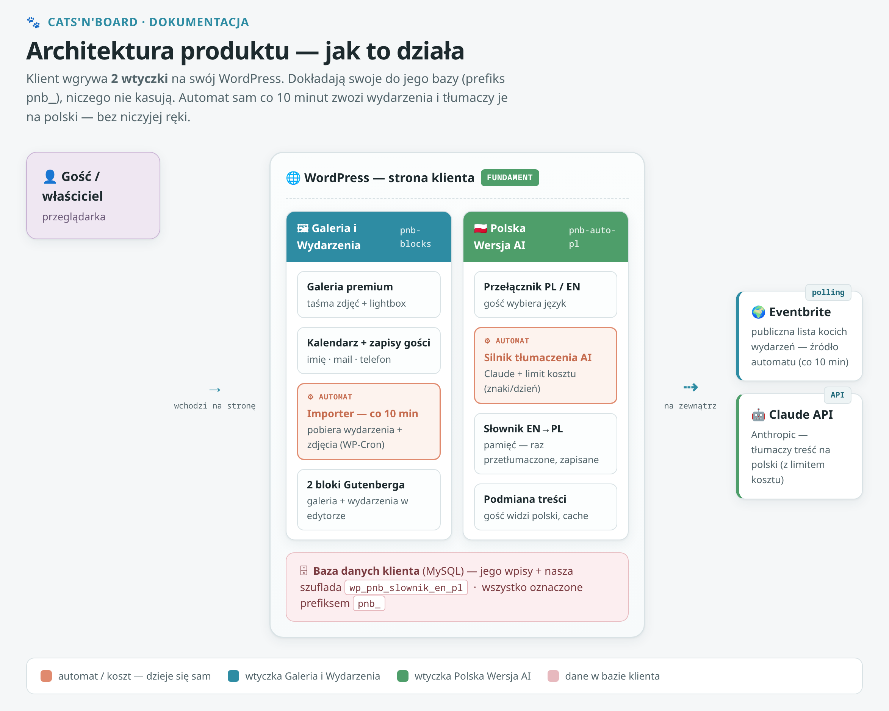

# Cats'N'Board — wtyczki WordPress 🐾


Dwie wtyczki WordPress dla strony kociego pensjonatu: wtyczka **galerii i wydarzeń** oraz
wtyczka **tłumaczenia AI** (EN→PL). W repozytorium jest też motyw demonstracyjny (folder
`catsnboard/`) — wyłącznie do testów, **nie trafia do paczki klienta**.

**Funkcje:**

- 🖼️ Galeria premium (taśma zdjęć + sekcja „Moments", lightbox)
- 📅 Kalendarz wydarzeń z zapisami gości (imię / e-mail / telefon, eksport do Excela)
- 🔒 RODO: eksport / usuwanie danych gościa po e-mailu (natywne narzędzia prywatności WordPressa)
- 🤖 Importer wydarzeń z Eventbrite (automat, WP-Cron co 10 min)
- 🇵🇱 Automatyczne tłumaczenie EN→PL przez Claude AI + przełącznik PL/EN
- 💾 Pamięć tłumaczeń (cache) — zero wywołań AI na wizytę gościa
- 🧩 2 bloki Gutenberga (galeria + wydarzenia, edytowalne w podglądzie)

> **Motyw w repozytorium jest TYLKO DO TESTÓW** — to odtworzona kopia wyglądu strony klienta
> (środowisko, na którym wygodnie sprawdzić wtyczki). **Nie wgrywać go na prawdziwą stronę klienta.**

---

## Jak to działa (w skrócie)

Klient wgrywa 2 wtyczki na swój WordPress. Wtyczki dokładają swoje do jego bazy (prefiks `pnb_`),
niczego nie kasują. Automat sam co 10 minut zwozi wydarzenia z Eventbrite, dodaje zdjęcia i tłumaczy
je na polski — bez niczyjej ręki.



## Jak to wygląda

Kalendarz wydarzeń ze zdjęciami, filtrami i zapisami — po polsku:


---

## Co jest w paczce

| Plik | Opis |
|------|------|
| **`pnb-blocks-…zip`** | Wtyczka „PNB Galeria i Wydarzenia" — galeria premium + kalendarz wydarzeń z zapisami gości (2 bloki Gutenberga, edycja w podglądzie). |
| **`pnb-auto-pl-…zip`** | Wtyczka „PNB Polska Wersja (AI)" — strona po polsku z przełącznikiem PL/EN; zmiany treści tłumaczą się same po zapisie. |
| **`INSTRUKCJA-DLA-KLIENTA.pdf`** | Instrukcja obsługi krok po kroku, ze zrzutami (wygodna do czytania i druku). **Zacznij od niej.** |
| **`INSTRUKCJA-DLA-KLIENTA.md`** | Ta sama instrukcja w wersji tekstowej (+ folder `zrzuty/`). |

## 📚 Pełna dokumentacja

W folderze **[`dokumentacja-techniczna/`](dokumentacja-techniczna/)** — dwie ścieżki + schematy:

| Dokument | Dla kogo |
|---|---|
| **[Instrukcja dla klienta](INSTRUKCJA-DLA-KLIENTA.md)** (ze zrzutami krok po kroku) | Właściciel strony, bez wiedzy technicznej |
| **[Instrukcja techniczna](dokumentacja-techniczna/INSTRUKCJA-TECHNICZNA.md)** (architektura, pliki, baza) | Informatyk / osoba wdrażająca |
| **[Diagramy](dokumentacja-techniczna/diagramy/)** (architektura · przepływ · pliki · odporność) | Jak działa system + z czego zbudowany |

---

## Instalacja na stronie TESTOWEJ (skrót)

1. *(opcjonalnie, tylko poligon testowy)* **Motyw**: spakuj folder `catsnboard/` z repozytorium
   do zipa → *Wygląd → Motywy → Dodaj → Wyślij* → Włącz (motyw sam utworzy podstrony)
2. **Wtyczki**: *Wtyczki → Dodaj nową → Wyślij* → oba zipy wtyczek → Włącz
   (galeria zamieni się na premium, powstanie kalendarz z przykładowymi wydarzeniami)
3. **Polska wersja** działa od razu (gotowe tłumaczenia w paczce). Klucz API
   (*Ustawienia → PNB Auto PL*) podłącz po to, żeby TWOJE zmiany tłumaczyły się same.

> ⚠️ Jeśli na stronie jest WPML — wyłącz go przed włączeniem Polskiej Wersji (szczegóły w instrukcji).

Pełna instalacja krok po kroku ze zrzutami: **[instrukcja dla klienta](INSTRUKCJA-DLA-KLIENTA.md)**.

---

## Dla dewelopera

**Technologie:** PHP · WordPress (hooki, WP-Cron, Gutenberg, Settings API) · Claude API (tłumaczenie) · Eventbrite (import wydarzeń).

**Struktura repo:**

```
pnb-blocks/               wtyczka: galeria + wydarzenia + importer (moduły w modules/)
pnb-auto-pl/              wtyczka: tłumaczenie AI EN→PL (silnik w inc/)
catsnboard/               motyw DEMONSTRACYJNY (tylko do testów)
dokumentacja-techniczna/  instrukcje + diagramy + źródła diagramów
zrzuty/                   zrzuty ekranu do instrukcji klienta
testy/                    golden-test (bash) + awarie/ (symulacje trybów awarii importera)
```

> **Brak build-stepu.** Kod PHP edytuje się wprost w folderach wtyczek — nie ma `npm install`
> ani bundlera. Biblioteki (GSAP, Lenis) i fonty są bundlowane lokalnie w repo.

**Licencja:** kod obu wtyczek i motywu — **GPL-2.0-or-later** (pełny tekst: `LICENSE` w głównym
folderze repozytorium oraz w każdym komponencie; noty bibliotek w `CREDITS.md`).
