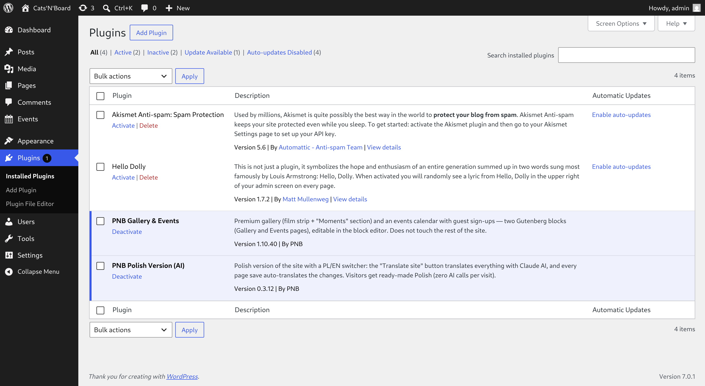
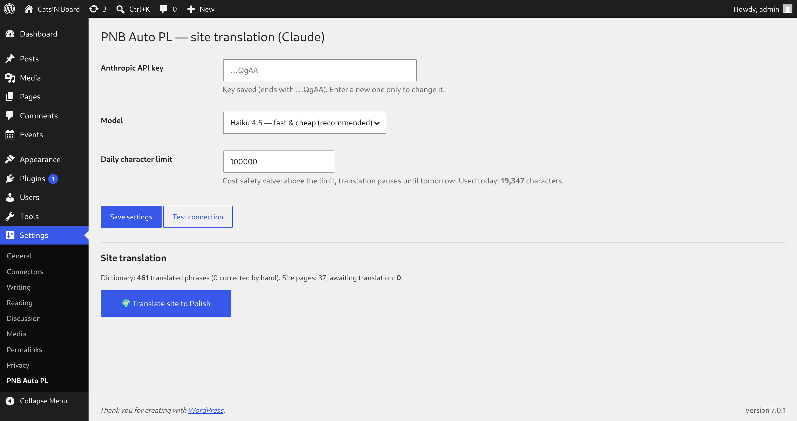
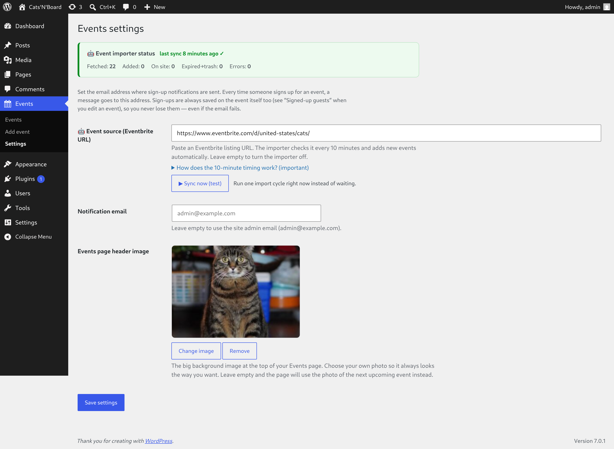
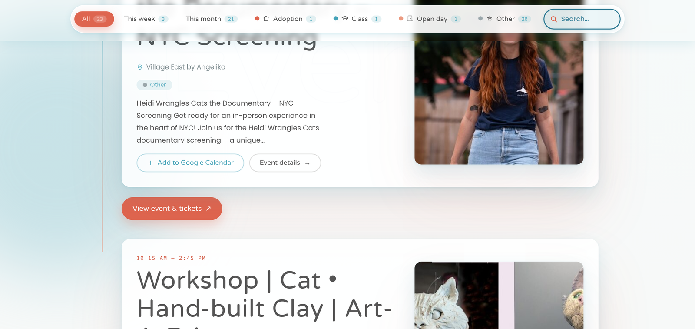

# 🐾 Cats'N'Board — instrukcja krok po kroku (prosto)

Ta instrukcja jest dla osoby, która **nie zna się na technicznych sprawach**. Prowadzi Cię za rękę,
z obrazkami. Jak coś jest niejasne — pokaż tę instrukcję komuś, kto ogarnia komputery, i pokaż mu
też drugą instrukcję (tę „dla informatyka").

> **Najważniejsze na start:** dostajesz **2 wtyczki** (dwa pliki `.zip`). Wgrywasz je na swoją stronę.
> Wtyczki **niczego nie kasują** — dokładają tylko swoje rzeczy. Przed wgraniem zrób **kopię zapasową**
> strony (poproś o to swój hosting albo informatyka — to 5 minut i chroni przed każdą niespodzianką).

---

## Krok 1 — Zaloguj się do panelu swojej strony

Wejdź na adres swojej strony i dopisz na końcu `/wp-admin` (np. `twojastrona.pl/wp-admin`).
Wpisz login i hasło. Zobaczysz **panel** — czarne menu po lewej stronie.

---

## Krok 2 — Wgraj pierwszą wtyczkę

W menu po lewej kliknij **Wtyczki → Dodaj nową → Wyślij wtyczkę na serwer**. Zobaczysz takie okno:

1. Kliknij **„Wybierz plik"** i wskaż plik `pnb-blocks-….zip`
2. Kliknij **„Zainstaluj teraz"**
3. Po chwili kliknij **„Włącz wtyczkę"**

Powtórz to samo dla drugiego pliku: `pnb-auto-pl-….zip`.

---

## Krok 3 — Sprawdź, że obie wtyczki są włączone

Kliknij **Wtyczki** w menu. Powinieneś zobaczyć obie nasze wtyczki jako **aktywne**
(podświetlone na niebiesko):

- **PNB Gallery & Events** — galeria i kalendarz wydarzeń
- **PNB Polish Version (AI)** — polska wersja strony

To znaczy, że wszystko działa. Wtyczki **same** utworzyły potrzebne strony i przykładowe wydarzenia.

> ⚠️ **Masz na liście wtyczkę „WPML"** (do wielu języków)? **Wyłącz ją** — nasza Polska Wersja robi
> polski sama, a dwa mechanizmy naraz będą się gryzły. Nie widzisz „WPML" na liście? To nie masz i nic nie robisz.

---

## Krok 4 — Podłącz klucz (żeby tłumaczenie działało samo)

Kliknij **Ustawienia → PNB Auto PL**. Zobaczysz taki ekran:

- W polu **„Anthropic API key"** wklej swój klucz (dostajesz go osobno — patrz niżej ⓘ)
- Kliknij **„Save settings"** (Zapisz)
- Możesz kliknąć **„Test connection"** — sprawdzi, czy klucz działa

> ⓘ **Skąd klucz?** Zakładasz konto na `console.anthropic.com`, doładowujesz małą kwotą
> (np. 5 dolarów starczy na długo), tworzysz klucz („Create Key"), kopiujesz go i wklejasz tutaj.
> Klucz zaczyna się od `sk-ant-…`. **Uwaga: pokaże się tylko raz — zapisz go sobie.**

Na dole tego ekranu jest przycisk **„Translate site to Polish"** (Przetłumacz witrynę) — kliknij go
raz na początku, żeby cała strona miała polską wersję od ręki.

---

## Krok 5 — Ustaw skąd brać wydarzenia (automat)

Kliknij **Events → Settings**. Zobaczysz taki ekran:

- W polu **„Event source (Eventbrite URL)"** wklej adres listy wydarzeń z Eventbrite
- Możesz kliknąć **„Sync now (test)"**, żeby od razu sprawdzić, czy pobiera

Od tej chwili **automat sam** co 10 minut sprawdza, czy pojawiły się nowe wydarzenia — pobiera je,
dodaje zdjęcia i tłumaczy na polski. **Nic nie musisz robić.**

---

## Krok 6 — Wpisz swój e-mail (żeby wiedzieć, kto się zapisał)

Na **tym samym ekranie** (Events → Settings) jest pole **„Notification email"** (e-mail powiadomień):

- Wpisz tam **swój adres e-mail**
- Kliknij **„Save settings"** (Zapisz) na dole

Od teraz **za każdym razem, gdy gość zapisze się na wydarzenie**, dostaniesz o tym e-mail z jego
danymi (imię, mail, telefon). Dzięki temu wiesz od razu, kto przychodzi.

> ℹ️ Jeśli zostawisz to pole puste, powiadomienia pójdą na adres administratora strony.
>
> ⚠️ E-maile czasem wpadają do **SPAMU** — tak działają serwery pocztowe, nie wtyczka. Nawet gdyby
> mail nie doszedł, **zapis nigdy nie ginie**: pełną listę gości masz zawsze w wydarzeniu (patrz niżej).

**Gdzie widać wszystkich zapisanych?** Otwórz dowolne wydarzenie do edycji — na dole jest ramka
**„Zapisani goście"** z listą i przyciskiem eksportu do Excela.

---

## Krok 7 — Zobacz efekt

Wydarzenia zbierają się same. Możesz je podejrzeć w **Events**:

A tak wygląda gotowa strona dla gości — **kalendarz wydarzeń** ze zdjęciami, filtrami i zapisami:

I **galeria** zdjęć:

Gość może przełączyć stronę na polski jednym kliknięciem (przełącznik **PL | EN** w rogu):

---

## To wszystko! 🎉

Od teraz strona **działa sama**: automat zwozi nowe wydarzenia i tłumaczy je na polski, goście
zapisują się na wydarzenia, a Ty nic nie musisz klikać.

**Gdyby coś nie grało** — pokaż informatykowi drugą instrukcję (techniczną) i diagramy z folderu
`diagramy/`. Tam jest dokładnie opisane, jak produkt jest zbudowany.
