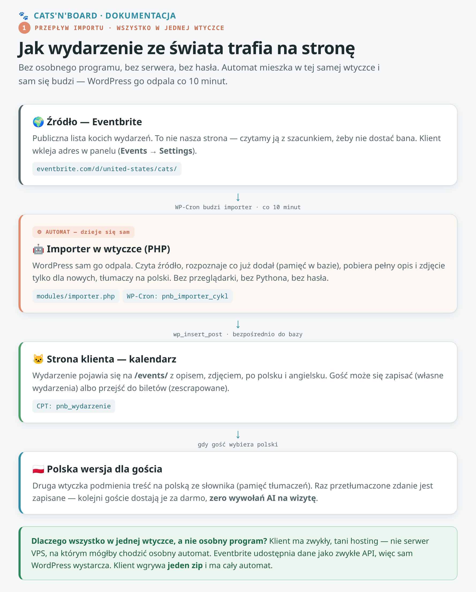
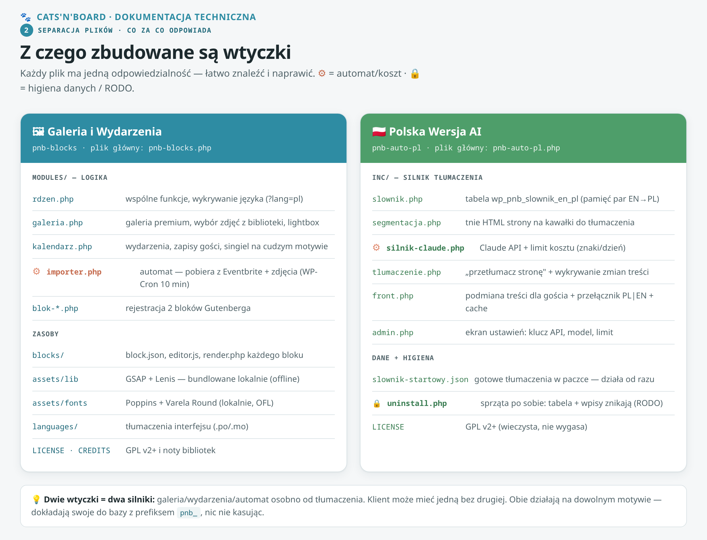
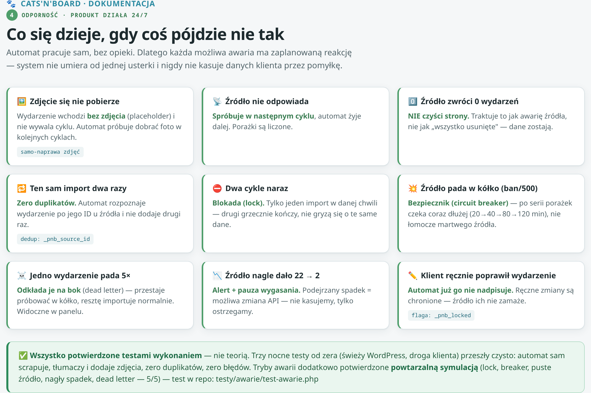

# Cats'N'Board — dokumentacja techniczna (dla informatyka)

Dokument dla osoby technicznej, która wdraża, ocenia lub utrzymuje produkt. Zakłada znajomość
WordPressa (wtyczki, hooki, WP-Cron, baza).

---

## 1. Architektura w skrócie

Produkt = **dwie wtyczki** (motyw w paczce jest tylko poligonem testowym — nie dla produkcji).
Wtyczki są **samowystarczalne**: działają na dowolnym motywie, dokładają swoje dane do bazy
klienta z prefiksem `pnb_`, niczego nie kasują ani nie nadpisują.


Trzy warstwy: **WordPress** (fundament + baza klienta) → **2 wtyczki** (silnik) → **motyw** (wygląd,
wymienny). Dwa zewnętrzne serwisy: **Eventbrite** (źródło wydarzeń, polling co 10 min — webhook dla
cudzych wydarzeń nie istnieje) i **API tłumaczące** (Claude albo darmowe Gemini — wybór w ustawieniach).

```
  Eventbrite ──(polling 10 min)──▶ importer.php ──▶ CPT pnb_wydarzenie ──▶ blok Gutenberg ──▶ front
                                                          │
  API (Claude/Gemini) ──▶ silnik ──▶ {prefiks}pnb_slownik_en_pl (cache) ──▶ front.php (podmiana PL) ──▶ gość
                                                          │
                                        baza klienta (MySQL, prefiks pnb_)
```

### ⚠️ Co tłumaczy CO — trzy warstwy, tylko jedna kosztuje

Częste nieporozumienie: **API NIE tłumaczy wszystkiego.** Płatne/limitowane jest tylko to, czego nie
da się załatwić za darmo. Kolejność od najtańszej:

| Warstwa | Co obsługuje | Czym | Koszt |
|---|---|---|---|
| **1. i18n** (standard WordPressa) | **stałe teksty wtyczek** — przyciski, etykiety, komunikaty, zasady zwrotów („Sign up", „Search", „Good to know") | `languages/*.po/.mo` + `__()`; front.php przełącza `locale` na `pl_PL` przy `?lang=pl` | **0 zł** |
| **2. Słownik-cache** | **powtórki** — każde zdanie tłumaczone RAZ, potem z bazy | tabela `{prefiks}pnb_slownik_en_pl` (schema wzorowana na TranslatePress) | **0 zł** |
| **3. Silnik API** | **tylko NOWE treści z bazy** — tytuły/opisy wydarzeń z importu, teksty wpisane w edytorze | `silnik-claude.php` / `silnik-gemini.php` przez router `pnb_pl_wywolaj_silnik()` | Claude: grosze · **Gemini: 0 zł** |

**Proporcje z realnego pomiaru** (pełne tłumaczenie witryny, 39 podstron): z **2380 segmentów** tylko
**548 poszło do API** — resztę (77%) załatwiły warstwy 1-2 za darmo. Po pierwszym przebiegu do API idą
już tylko nowe wydarzenia (kilka zdań na cykl).

**Dlaczego i18n nie wystarczy na wszystko:** i18n tłumaczy WYŁĄCZNIE teksty zaszyte w kodzie (przez
`__()`), bo pary EN→PL muszą istnieć w `.po` ZANIM kod pojedzie do klienta. Wydarzenia z Eventbrite
powstają po stronie organizatora co 10 minut — żaden plik `.po` ich nie zna i znać nie może. Dlatego
warstwa 3 (silnik). Odwrotnie też: silnik nie tyka tekstów z kodu (segmentacja czyta treść stron,
nie źródła PHP) — stąd oba mechanizmy są potrzebne i się nie dublują.

### Przepływ importu — jak wydarzenie trafia na stronę



---

## 2. Separacja plików — z czego zbudowane są wtyczki



### `pnb-blocks` — „PNB Galeria i Wydarzenia"

| Plik / folder | Odpowiedzialność |
|---|---|
| `pnb-blocks.php` | Plik główny: `define()` wersji, ładowanie modułów przez `require_once`, samozasiew demo przy aktywacji |
| `modules/rdzen.php` | Wspólne funkcje, wykrywanie języka (`?lang=pl`) |
| `modules/galeria.php` | Galeria premium (grid + wybór zdjęć z biblioteki WP), lightbox, assety warunkowe |
| `modules/kalendarz.php` | CPT `pnb_wydarzenie`, karty nadchodzących, zapisy gości (CPT `pnb_zapis`), szablon singla na cudzym motywie |
| `modules/importer.php` | **Automat** (WP-Cron, co 10 min): pobiera wydarzenia z Eventbrite + zdjęcia, dedup po `_pnb_source_id`, samo-naprawa zdjęć, sprzątanie wygasłych |
| `modules/rodo.php` | **RODO**: wpięcie zapisów gości w natywne narzędzia prywatności WP (eksport/usuwanie danych po e-mailu, porcjami po 100) |
| `modules/blok-galeria.php`, `modules/blok-wydarzenia.php` | Rejestracja 2 bloków Gutenberga |
| `blocks/galeria/`, `blocks/wydarzenia/` | `block.json`, `editor.js`, `render.php` (dynamiczny render bloków) |
| `assets/css`, `assets/js` | Style i skrypty galerii/kalendarza — ładowane tylko gdy blok realnie renderuje |
| `assets/lib` | GSAP + ScrollTrigger + Lenis — **bundlowane lokalnie** (offline, stała wersja, prefiks `pnb-` w handlach) |
| `assets/fonts` | Poppins + Varela Round (lokalnie, licencja OFL) |
| `languages/` | Tłumaczenia interfejsu (`.po`/`.mo`) |
| `LICENSE`, `CREDITS.md` | GPL-2.0-or-later + noty bibliotek |
| `uninstall.php` | Sprzątanie przy odinstalowaniu |

**Automat (importer) — jak działa:** WP-Cron budzi `pnb_importer_cykl` co 10 minut. Cykl czyta
publiczną listę Eventbrite, deduplikuje po `_pnb_source_id`, tworzy nowe wydarzenia z obrazkami,
dociąga brakujące zdjęcia (max kilka na cykl — grzeczność wobec źródła), sprząta wygasłe. Wszystko
logowane (`pnb_importer_log`). Zero ręcznej ingerencji.

---

### `pnb-auto-pl` — „PNB Polska Wersja"

| Plik | Odpowiedzialność |
|---|---|
| `pnb-auto-pl.php` | Plik główny: wersja, ładowanie `inc/`, `CREATE TABLE` słownika przy aktywacji |
| `inc/slownik.php` | Tabela `{prefiks}pnb_slownik_en_pl` — pamięć par EN→PL (cache tłumaczeń) |
| `inc/segmentacja.php` | Tnie HTML strony na segmenty blokowe + pary linków do tłumaczenia |
| `inc/silnik-claude.php` | Claude API (batch), walidacja tagów/kses, **limit kosztu** (znaki/dzień) + **router silnika** (`pnb_pl_wywolaj_silnik()` — wybiera Claude albo Gemini wg ustawień) |
| `inc/silnik-gemini.php` | **Gemini API — silnik DARMOWY** (bez karty). Throttle 15 zapytań/min i licznik zapytań/dobę (reset o północy pacyficznej — tak resetuje Google), obsługa 429, model w opcji (Google wycofuje modele bez uprzedzenia) |
| `languages/*.po` + `*.mo` | **Warstwa i18n — ZA DARMO**: gotowe tłumaczenia stałych tekstów wtyczki. To NIE przechodzi przez API |
| `inc/tlumaczenie.php` | AJAX „przetłumacz stronę", wykrywanie zmian treści (`save_post`) |
| `inc/front.php` | Podmiana par na stronie gościa (`strtr`), przełącznik PL\|EN, cache przetłumaczonego HTML |
| `inc/admin.php` | Ekran ustawień (klucz API, model, limit) + „Przetłumacz witrynę" |
| `dane/slownik-startowy.json` | Gotowe tłumaczenia w paczce — polski działa od razu po instalacji |
| `uninstall.php` | **RODO + higiena sekretów:** przy odinstalowaniu usuwa tabelę słownika, **wszystkie opcje wtyczki — w tym KLUCZE API obu silników** (Claude `pnb_auto_pl_klucz` i Gemini `pnb_auto_pl_gemini_klucz`) oraz transienty (LIKE **escapowany** przez `$wpdb->esc_like()` — wzorzec z rdzenia WP, żeby nie tknąć cudzych). ⚠️ Dodajesz opcję w kodzie → dopisz ją tam w tym samym PR (bramka: grep w komentarzu pliku) |
| `LICENSE` | GPL-2.0-or-later |

**Model tłumaczenia:** treść źródłowa jest angielska (fundament). Wtyczka buduje z niej polską wersję
dla gości: słownik EN→PL + przełącznik. Raz przetłumaczona fraza ląduje w słowniku (cache) — kolejne
odsłony są darmowe (zero wywołań AI per wizyta gościa). Limit znaków/dzień = bezpiecznik kosztu.

---

## 3. Odporność — co gdy coś padnie

Automat pracuje 24/7 bez opieki, więc każda awaria ma zaplanowaną reakcję. System nie umiera od jednej
usterki i nigdy nie kasuje danych klienta przez pomyłkę.



Kluczowe mechanizmy (wszystkie w `modules/importer.php`): **lock** (jeden cykl naraz, TTL 5 min +
`register_shutdown_function`), **circuit breaker** (pauzy 20→40→80→120 min przy serii porażek źródła),
**dead letter queue** (wydarzenie padające ≥5× odkładane na bok), **ochrona przed pustym źródłem**
(0 wydarzeń = nie czyści strony), **alert podejrzanego spadku** (22→2 = pauza wygasania), **dedup** po
`_pnb_source_id`, **samo-naprawa zdjęć**, poszanowanie ręcznych zmian (`_pnb_locked`, `_pnb_img_removed`).

Mechanizmy są **potwierdzone symulacją na żywym WordPressie** (lock, breaker z eskalacją, puste
źródło ×3, podejrzany spadek, dead letter) — powtarzalny test: `testy/awarie/test-awarie.php`
(instrukcja uruchomienia w nagłówku pliku).

---

## 4. Baza danych

Wtyczki dokładają do bazy klienta:

- **Tabela** `{prefiks}pnb_slownik_en_pl` — słownik tłumaczeń (tworzona przez `dbDelta` przy aktywacji)
- **Wpisy** w `wp_posts`: CPT `pnb_wydarzenie` (wydarzenia), `pnb_zapis` (zapisy gości)
- **Meta** w `wp_postmeta` z prefiksem `_pnb_` (daty, źródło, dane zapisu)
- **Opcje** w `wp_options` z prefiksem `pnb_` (ustawienia, log importera, cache)

**Prywatność (RODO):** CPT `pnb_zapis` jest `public=false, show_ui=false` — dane gości (imię/mail/tel)
nie są dostępne przez REST API ani wyszukiwarkę frontową; widoczne w metaboxie wydarzenia w panelu
admina (+ eksport CSV). Zapisy są wpięte w **natywne narzędzia prywatności WordPressa**
(Narzędzia → Eksport / Usuwanie danych osobowych): żądanie „pokaż / usuń moje dane" obsługuje się
po e-mailu, przekrojowo przez wszystkie wydarzenia (`modules/rodo.php`). Odinstalowanie wtyczki usuwa dane.

---

## 5. Punkty integracji z WordPressem (hooki)

| Hook / mechanizm | Gdzie | Co robi |
|---|---|---|
| `register_activation_hook` / `register_deactivation_hook` | oba pliki główne | samozasiew demo + tabela słownika przy aktywacji; sprzątanie crona przy dezaktywacji |
| WP-Cron `pnb_importer_cykl` (co 10 min) | `pnb-blocks/modules/importer.php` | automatyczny import wydarzeń z Eventbrite |
| `save_post` | `pnb-auto-pl/inc/tlumaczenie.php` | wykrycie zmiany treści → dotłumaczenie po zapisie |
| AJAX `pnb_pl_test` / `pnb_pl_tlumacz_strone` / `pnb_pl_wyczysc_stale` | `pnb-auto-pl/inc/admin.php` | test klucza, „przetłumacz stronę", czyszczenie listy nieaktualnych |
| `admin_post[_nopriv]_pnb_zapis` | `pnb-blocks/modules/kalendarz.php` | zapis gościa na wydarzenie (formularz frontowy) |
| `admin_post_pnb_export_csv` | `pnb-blocks/modules/kalendarz.php` | eksport listy zapisanych gości do CSV |
| `wp_privacy_personal_data_exporters` / `_erasers` | `pnb-blocks/modules/rodo.php` | RODO: eksport/usuwanie zapisów gościa po e-mailu (Narzędzia → Eksport / Usuwanie danych osobowych) |

---

## 6. Bezpieczeństwo

Kod przechodził audyty adwersaryjne — zabezpieczenia są konsekwentnie stosowane:

- **Nonce / weryfikacja żądań** — formularze i endpointy AJAX chronione (`wp_nonce_field`,
  `wp_verify_nonce`, `check_ajax_referer`).
- **Kontrola uprawnień** — akcje admina za `current_user_can`; CPT `pnb_zapis` z danymi gości:
  `public=false, show_ui=false` — niedostępny przez REST ani wyszukiwarkę frontową.
- **Sanityzacja wejścia** — `sanitize_*` na danych z formularzy.
- **Escaping wyjścia** — `esc_html` / `esc_attr` / `esc_url` przy renderowaniu (ponad 250 wywołań).
- **Zapytania SQL** — zawsze przez WP API; bezpośrednie query wyłącznie przez `$wpdb->prepare`.
- **Klucz API** — w `wp_options` (`autoload=false`), w UI maskowany (widoczne tylko końcowe znaki),
  nigdy nie wraca do HTML w całości.

---

## 7. Wymagania i uwagi wdrożeniowe

- **Hosting:** zwykły (współdzielony) wystarcza — automat działa na WP-Cron, bez osobnego serwera/VPS.
- **Język witryny (Ustawienia → Ogólne):** zostaw **English**. Mechanizm PL buduje polską wersję na
  fundamencie angielskim; zmiana języka witryny na polski psuje ten mechanizm. Panel admina można
  ustawić po polsku w profilu użytkownika (nie w ustawieniach witryny).
- **Konflikt z WPML:** jeśli na stronie jest WPML, wyłącz go przed aktywacją Polskiej Wersji.
- **Klucz API:** przechowywany w `wp_options` (zamaskowany w UI). Koszt kontrolowany limitem znaków/dzień.
- **Cache:** przetłumaczony HTML jest cache'owany (transient) z auto-bumpem przy zmianie wersji wtyczki.

---

## 8. Pliki źródłowe diagramów

Diagramy PNG w `diagramy/` są wygenerowane z edytowalnych źródeł HTML w
`diagramy-zrodla/` (jeden `style.css` + po jednym pliku na diagram). Żeby zmienić diagram: edytuj
odpowiedni `.html`, otwórz w przeglądarce, zrób zrzut albo wyrenderuj do PNG. Styl (kolory, czcionki)
jest w `style.css` — zmiana tam przechodzi na wszystkie diagramy naraz.

---

## Historia zmian

Pełna historia wersji: **[CHANGELOG.md](../CHANGELOG.md)** (format Keep a Changelog).
Opisowe wersje wydań dla klienta — w [GitHub Releases](../../../releases).
