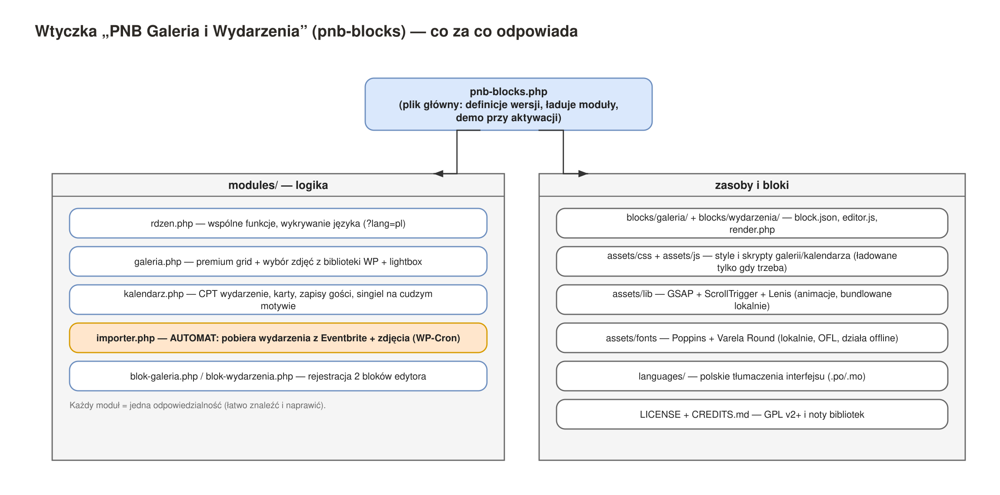
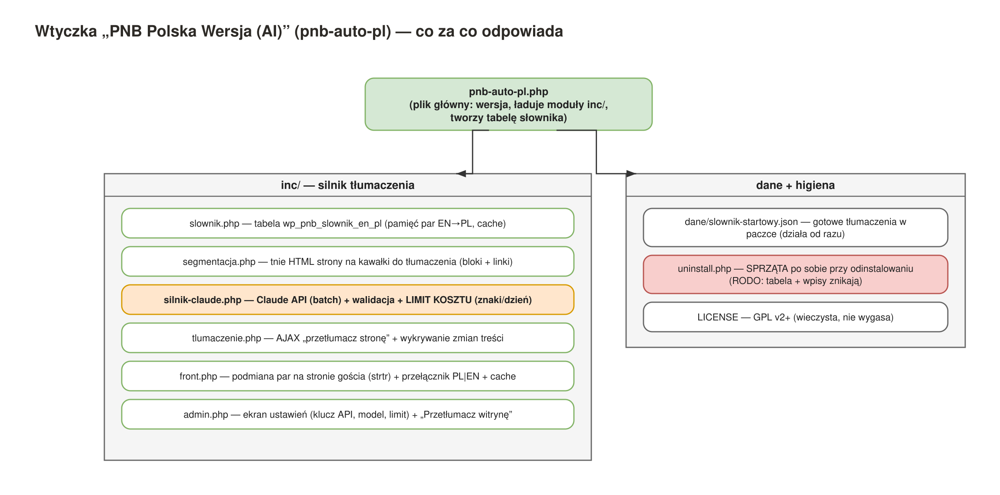

# Cats'N'Board — dokumentacja techniczna (dla informatyka)

Dokument dla osoby technicznej, która wdraża, ocenia lub utrzymuje produkt. Zakłada znajomość
WordPressa (wtyczki, hooki, WP-Cron, baza).

---

## 1. Architektura w skrócie

Produkt = **dwie wtyczki** (motyw w paczce jest tylko poligonem testowym — nie dla produkcji).
Wtyczki są **samowystarczalne**: działają na dowolnym motywie, dokładają swoje dane do bazy
klienta z prefiksem `pnb_`, niczego nie kasują ani nie nadpisują.

Trzy warstwy: **WordPress** (fundament + baza klienta) → **2 wtyczki** (silnik) → **motyw** (wygląd,
wymienny). Dwa zewnętrzne serwisy: **Eventbrite** (źródło wydarzeń, polling co 10 min — webhook dla
cudzych wydarzeń nie istnieje) i **Claude API** (tłumaczenie, z dziennym limitem znaków jako
bezpiecznikiem kosztu).

---

## 2. Wtyczka `pnb-blocks` — „PNB Galeria i Wydarzenia"

| Plik / folder | Odpowiedzialność |
|---|---|
| `pnb-blocks.php` | Plik główny: `define()` wersji, ładowanie modułów przez `require_once`, samozasiew demo przy aktywacji |
| `modules/rdzen.php` | Wspólne funkcje, wykrywanie języka (`?lang=pl`) |
| `modules/galeria.php` | Galeria premium (grid + wybór zdjęć z biblioteki WP), lightbox, assety warunkowe |
| `modules/kalendarz.php` | CPT `pnb_wydarzenie`, karty nadchodzących, zapisy gości (CPT `pnb_zapis`), szablon singla na cudzym motywie |
| `modules/importer.php` | **Automat** (WP-Cron, co 10 min): pobiera wydarzenia z Eventbrite + zdjęcia, dedup po `_pnb_source_id`, samo-naprawa zdjęć, sprzątanie wygasłych |
| `modules/blok-galeria.php`, `modules/blok-wydarzenia.php` | Rejestracja 2 bloków Gutenberga |
| `blocks/galeria/`, `blocks/wydarzenia/` | `block.json`, `editor.js`, `render.php` (dynamiczny render bloków) |
| `assets/css`, `assets/js` | Style i skrypty galerii/kalendarza — ładowane tylko gdy blok realnie renderuje |
| `assets/lib` | GSAP + ScrollTrigger + Lenis — **bundlowane lokalnie** (offline, stała wersja, prefiks `pnb-` w handlach) |
| `assets/fonts` | Poppins + Varela Round (lokalnie, licencja OFL) |
| `languages/` | Tłumaczenia interfejsu (`.po`/`.mo`) |
| `LICENSE`, `CREDITS.md` | GPL-2.0-or-later + noty bibliotek |
| `uninstall.php` | Sprzątanie przy odinstalowaniu |

**Automat (importer) — jak działa:** WP-Cron budzi `pnb_importer_cykl` co 10 minut. Cykl czyta
publiczną listę Eventbrite, deduplikuje po `_pnb_source_id`, tworzy nowe wydarzenia z obrazkami,
dociąga brakujące zdjęcia (max kilka na cykl — grzeczność wobec źródła), sprząta wygasłe. Wszystko
logowane (`pnb_importer_log`). Zero ręcznej ingerencji.

---

## 3. Wtyczka `pnb-auto-pl` — „PNB Polska Wersja (AI)"

| Plik | Odpowiedzialność |
|---|---|
| `pnb-auto-pl.php` | Plik główny: wersja, ładowanie `inc/`, `CREATE TABLE` słownika przy aktywacji |
| `inc/slownik.php` | Tabela `wp_pnb_slownik_en_pl` — pamięć par EN→PL (cache tłumaczeń) |
| `inc/segmentacja.php` | Tnie HTML strony na segmenty blokowe + pary linków do tłumaczenia |
| `inc/silnik-claude.php` | Claude API (batch), walidacja, **limit kosztu** (znaki/dzień) |
| `inc/tlumaczenie.php` | AJAX „przetłumacz stronę", wykrywanie zmian treści (`save_post`) |
| `inc/front.php` | Podmiana par na stronie gościa (`strtr`), przełącznik PL\|EN, cache przetłumaczonego HTML |
| `inc/admin.php` | Ekran ustawień (klucz API, model, limit) + „Przetłumacz witrynę" |
| `dane/slownik-startowy.json` | Gotowe tłumaczenia w paczce — polski działa od razu po instalacji |
| `uninstall.php` | **RODO:** przy odinstalowaniu usuwa tabelę słownika i wpisy |
| `LICENSE` | GPL-2.0-or-later |

**Model tłumaczenia:** treść źródłowa jest angielska (fundament). Wtyczka buduje z niej polską wersję
dla gości: słownik EN→PL + przełącznik. Raz przetłumaczona fraza ląduje w słowniku (cache) — kolejne
odsłony są darmowe (zero wywołań AI per wizyta gościa). Limit znaków/dzień = bezpiecznik kosztu.

---

## 4. Baza danych

Wtyczki dokładają do bazy klienta:

- **Tabela** `wp_pnb_slownik_en_pl` — słownik tłumaczeń (tworzona przez `dbDelta` przy aktywacji)
- **Wpisy** w `wp_posts`: CPT `pnb_wydarzenie` (wydarzenia), `pnb_zapis` (zapisy gości)
- **Meta** w `wp_postmeta` z prefiksem `_pnb_` (daty, źródło, dane zapisu)
- **Opcje** w `wp_options` z prefiksem `pnb_` (ustawienia, log importera, cache)

**Prywatność:** CPT `pnb_zapis` jest `public=false, show_ui=false` — dane gości (imię/mail/tel)
nie są dostępne przez REST API ani wyszukiwarkę frontową; widoczne tylko w metaboxie wydarzenia
w panelu admina. Odinstalowanie wtyczki usuwa jej dane (higiena + RODO).

---

## 5. Wymagania i uwagi wdrożeniowe

- **Hosting:** zwykły (współdzielony) wystarcza — automat działa na WP-Cron, bez osobnego serwera/VPS.
- **Język witryny (Ustawienia → Ogólne):** zostaw **English**. Mechanizm PL buduje polską wersję na
  fundamencie angielskim; zmiana języka witryny na polski psuje ten mechanizm. Panel admina można
  ustawić po polsku w profilu użytkownika (nie w ustawieniach witryny).
- **Konflikt z WPML:** jeśli na stronie jest WPML, wyłącz go przed aktywacją Polskiej Wersji.
- **Klucz API:** przechowywany w `wp_options` (zamaskowany w UI). Koszt kontrolowany limitem znaków/dzień.
- **Cache:** przetłumaczony HTML jest cache'owany (transient) z auto-bumpem przy zmianie wersji wtyczki.

---

## 6. Pliki źródłowe diagramów

Diagramy są w formacie **draw.io** (`architektura-catsnboard.drawio`, plik wielostronicowy).
Otwórz go na [app.diagrams.net](https://app.diagrams.net) (web, bez instalacji) albo w drawio-desktop
— możesz je edytować. PNG-i w `diagramy/` są wygenerowane z tego źródła.
